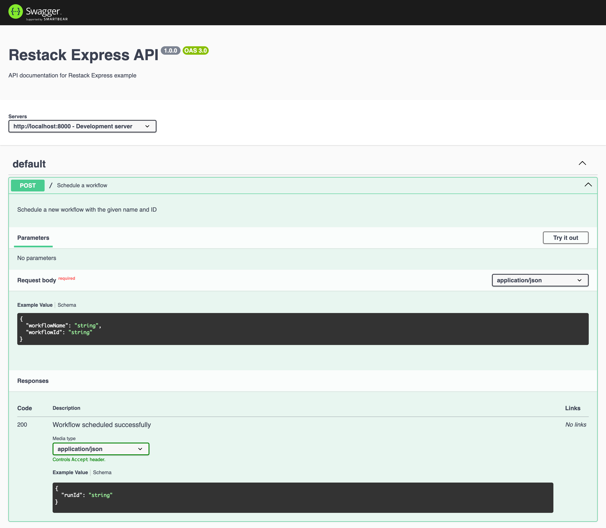

# Run Restack in Docker

docker run -d --pull always --name restack -p 5233:5233 -p 6233:6233 -p 7233:7233 ghcr.io/restackio/restack:main

# Open the Desktop UI

http://localhost:5233

# Install dependencies

```
pnpm i
```

## Run the Express server

```
pnpm dev
```

The server should be up at http://localhost:8000
The Swagger documentation is available at http://localhost:8000/api-docs




## Send a test request to the server from Swagger UI

Navigate to http://localhost:8000/api-docs in your browser to access the Swagger UI.

You can test the API endpoints directly from the UI by clicking on the POST endpoint and using the "Try it out" button.

## Build and Run Docker Container

Build the Docker image of the server incl. Swagger UI and run the container with:

```
pnpm docker:dev
```

## (Optional) Deploy on Restack Cloud

pnpm restack-up

To deploy the application on Restack, you can use the provided `restack_up.mjs` script. This script utilizes the Restack Cloud SDK to define and deploy your application stack. It sets up the necessary environment variables and configures the application for deployment.

To get started, ensure you have the required Restack Cloud credentials and environment variables set up. Then, run the script to initiate the deployment process.

For more detailed information on deploying your repository to Restack, refer to the [Restack Cloud deployment documentation](https://docs.restack.io/restack-cloud/deployrepo).
